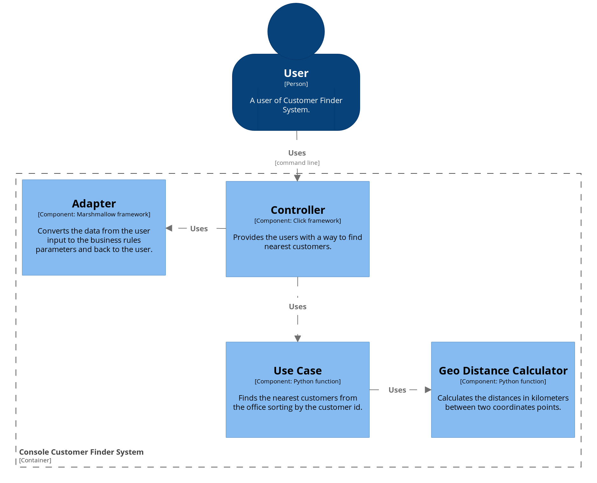

# Python Clean Architecture Example

An customer finder system using the clean architecture.

## Installation and Usage

You need to have docker installed.
Inside the root directory run:

> docker build -t python-clean-arch .

Then:

> docker run --rm python-clean-arch <path-to-customer-file>

You can list the options with the `--help` command:
entities
> docker run --rm python-clean-arch --help

## Developing

You will need [pipenv](https://docs.pipenv.org/) installed.
Inside the project directory run:

> pipenv install --dev

This should all core and dev dependencies.

To run the tests run:

> PYTHONPATH=$PWD py.test

## Architecture

The Uncle Bob's *clean architecture* approach was used the build this project.
It contains two main submodules: **cli** and **core**.

The **core** submodule contains the business rules that are essential for ou application, that is, the domain entities and use cases.

The **cli** submodule contains the presenter and the adapters, that is, the code in this layer interacts with the user and convert data from the format most convenient for the use cases and entities and then back from the use cases to the presenter.

